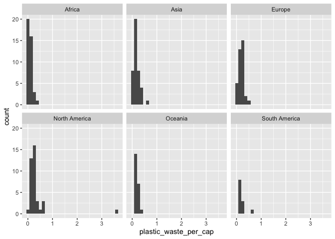
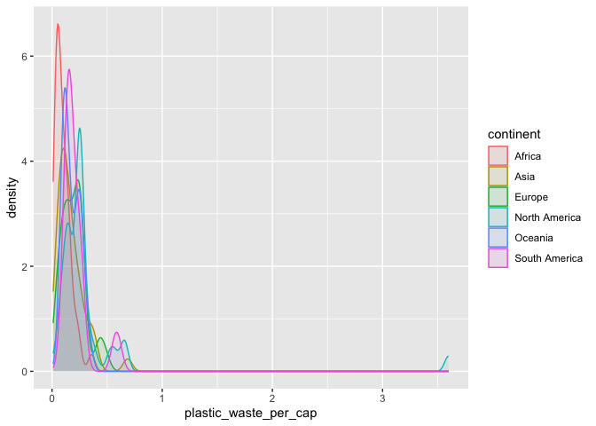

Lab 02 - Plastic waste
================
Charlize Ezernack
01/21/26

## Load packages and data

``` r
library(tidyverse) 
```

``` r
plastic_waste <- read.csv("data/plastic-waste.csv")
```

## Exercises

### Exercise 1

Remove this text, and add your answer for Exercise 1 here.

``` r
ggplot(data = plastic_waste, aes(x = plastic_waste_per_cap)) + geom_histogram(bindwidth = 0.2) + facet_wrap(~continent)
```

    ## Warning in geom_histogram(bindwidth = 0.2): Ignoring unknown parameters:
    ## `bindwidth`

    ## `stat_bin()` using `bins = 30`. Pick better value `binwidth`.

    ## Warning: Removed 51 rows containing non-finite outside the scale range
    ## (`stat_bin()`).

<!-- -->
Africa is the continent that overall does a better job at minimizing
plastic waste per capita; however, plastic waste output varies by
country inside the continents itself

### Exercise 2

``` r
ggplot(data = plastic_waste, aes(x=plastic_waste_per_cap, color = continent, fill = continent)) + geom_density(alpha = 0.1)
```

    ## Warning: Removed 51 rows containing non-finite outside the scale range
    ## (`stat_density()`).

<!-- --> Fill
and color occurred within the aes() function since it has to do with
mapping the quality of each point such as defining its color by
continent, and viewing density by continent color. However, alpha is
defined within geom_density since transparency has to do with the
mapping of the graph between the points overall.

### Exercise 3

Remove this text, and add your answer for Exercise 3 here.

``` r
# insert code here
```

### Exercise 4

Remove this text, and add your answer for Exercise 4 here.

``` r
# insert code here
```

``` r
# insert code here
```

``` r
# insert code here
```

``` r
# insert code here
```

### Exercise 5

Remove this text, and add your answer for Exercise 5 here.

``` r
# insert code here
```
