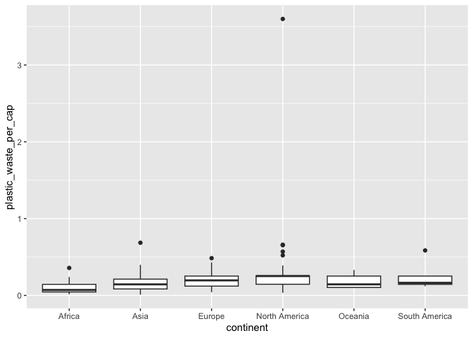
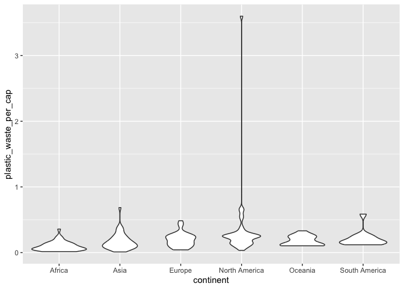
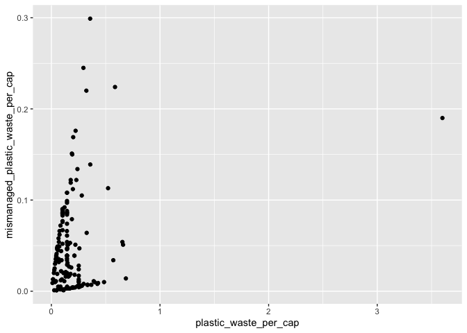
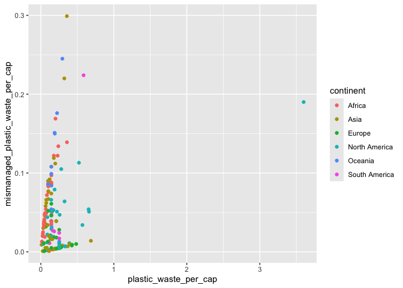
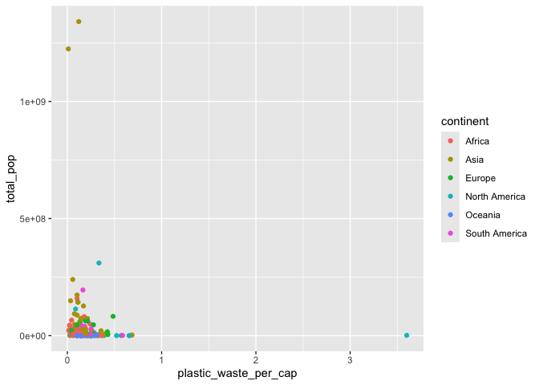
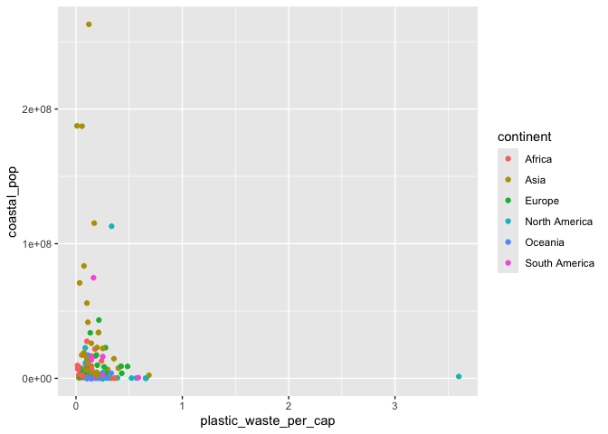
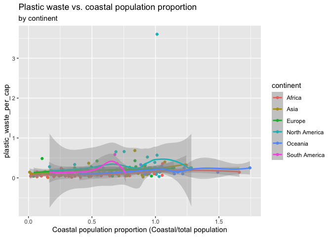

Lab 02 - Plastic waste
================
Charlize Ezernack
01/21/26

## Load packages and data

``` r
library(tidyverse) 
```

``` r
plastic_waste <- read.csv("data/plastic-waste.csv")
```

## Exercises

### Exercise 1

Remove this text, and add your answer for Exercise 1 here.

``` r
ggplot(data = plastic_waste, aes(x = plastic_waste_per_cap)) + geom_histogram(bindwidth = 0.2) + facet_wrap(~continent)
```

    ## Warning in geom_histogram(bindwidth = 0.2): Ignoring unknown parameters:
    ## `bindwidth`

    ## `stat_bin()` using `bins = 30`. Pick better value `binwidth`.

    ## Warning: Removed 51 rows containing non-finite outside the scale range
    ## (`stat_bin()`).

<!-- -->
Africa is the continent that overall does a better job at minimizing
plastic waste per capita; however, plastic waste output varies by
country inside the continents itself

### Exercise 2

``` r
ggplot(data = plastic_waste, aes(x=plastic_waste_per_cap, color = continent, fill = continent)) + geom_density(alpha = 0.1)
```

    ## Warning: Removed 51 rows containing non-finite outside the scale range
    ## (`stat_density()`).

<!-- --> Fill
and color occurred within the aes() function since it has to do with
mapping the quality of each point such as defining its color by
continent, and viewing density by continent color. However, alpha is
defined within geom_density since transparency has to do with the
mapping of the graph between the points overall.

### Exercise 3

Remove this text, and add your answer for Exercise 3 here.

``` r
ggplot(plastic_waste, aes(x=continent, y=plastic_waste_per_cap)) + geom_boxplot()
```

    ## Warning: Removed 51 rows containing non-finite outside the scale range
    ## (`stat_boxplot()`).

<!-- -->

``` r
ggplot(plastic_waste, aes(x=continent, y=plastic_waste_per_cap)) + geom_violin()
```

    ## Warning: Removed 51 rows containing non-finite outside the scale range
    ## (`stat_ydensity()`).

<!-- -->

The data from the box plot distribution clearly identifies the outliers,
mean, and range of the data. Whereas, the violin plots demonstrate much
more nuance about the spread of the data, outliers, and a fuller picture
of the clustering of the data.

### Exercise 4

Remove this text, and add your answer for Exercise 4 here.

``` r
ggplot(plastic_waste, aes(x=plastic_waste_per_cap, y= mismanaged_plastic_waste_per_cap)) + geom_point()
```

    ## Warning: Removed 51 rows containing missing values or values outside the scale range
    ## (`geom_point()`).

<!-- -->

The relationship shows those who do not have much mismanaged waste per
capita have less plastic waste per capita

``` r
ggplot(plastic_waste, aes(x=plastic_waste_per_cap, y= mismanaged_plastic_waste_per_cap, color = continent)) + geom_point()
```

    ## Warning: Removed 51 rows containing missing values or values outside the scale range
    ## (`geom_point()`).

<!-- -->
With Europe there seems to be a positive linear correlation between
plastic waste and mismanaged waste per capita. However, with Africa it
seems that even low there are low levels of plastic waste generally,
there is a presence of a lot of mismanaged plastic waste per capita.

``` r
ggplot(plastic_waste, aes(x=plastic_waste_per_cap, y= total_pop, color = continent)) + geom_point()
```

    ## Warning: Removed 61 rows containing missing values or values outside the scale range
    ## (`geom_point()`).

<!-- -->

``` r
ggplot(plastic_waste, aes(x=plastic_waste_per_cap, y= coastal_pop, color = continent)) + geom_point()
```

    ## Warning: Removed 51 rows containing missing values or values outside the scale range
    ## (`geom_point()`).

<!-- -->

The scatterplot for total population and plastic waste per capita is
more clustered together and less outliers which leads me to believe
there is a stronger linear association, rather than total costal
population and plastic waste per capita

### Exercise 5

Remove this text, and add your answer for Exercise 5 here.

``` r
plastic_waste %>%
  filter(plastic_waste_per_cap > 3)
```

    ##   code              entity     continent year gdp_per_cap plastic_waste_per_cap
    ## 1  TTO Trinidad and Tobago North America 2010    31260.91                   3.6
    ##   mismanaged_plastic_waste_per_cap mismanaged_plastic_waste coastal_pop
    ## 1                             0.19                    94066     1358433
    ##   total_pop
    ## 1   1341465

``` r
ggplot(plastic_waste, aes(x= coastal_pop/total_pop , y= plastic_waste_per_cap, color = continent)) + geom_jitter() + geom_smooth() + labs(title = "Plastic waste vs. coastal population proportion" , subtitle = "by continent" , x = "Coastal population proportion (Coastal/total population")
```

    ## `geom_smooth()` using method = 'loess' and formula = 'y ~ x'

    ## Warning: Removed 61 rows containing non-finite outside the scale range
    ## (`stat_smooth()`).

    ## Warning: Removed 61 rows containing missing values or values outside the scale range
    ## (`geom_point()`).

<!-- -->
